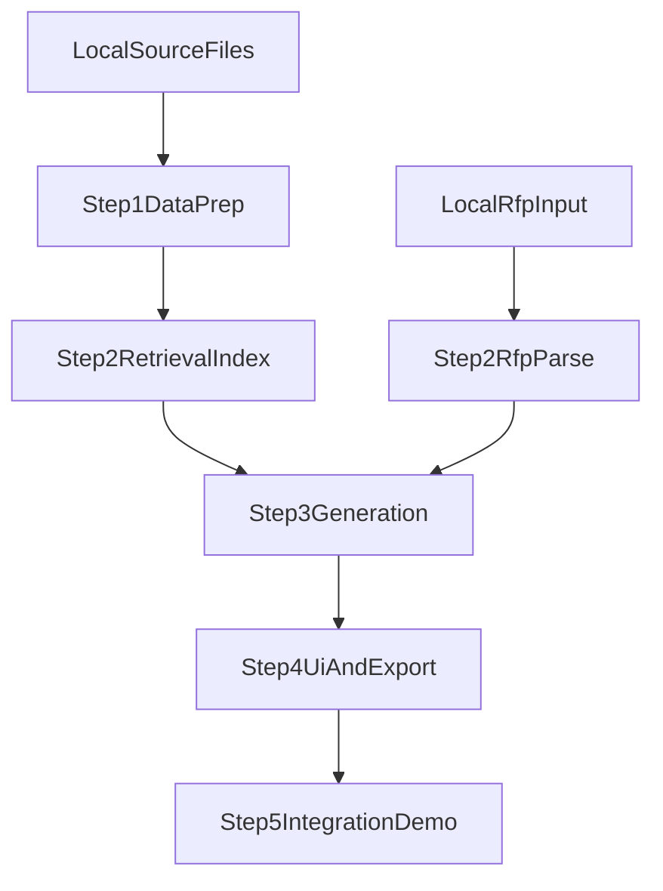

# 아키텍처

## 시스템 개요

프로젝트는 step 단위 모듈로 구성됩니다.

1. `step1_data_prep`: 로컬 제안서에서 검색용 청크 생성
2. `step2_retrieval_and_rfp_parse`: 검색 인덱스 구축 + RFP 구조화
3. `step3_generation_pipeline`: 요구사항 + 검색 컨텍스트 기반 섹션 생성
4. `step4_ui_and_export`: 사용자 UI 흐름 및 문서 출력
5. `step5_integration_and_demo`: 종단 간 검증 및 데모 패키지 정리

## 데이터 경계

- 민감한 원본 데이터는 버전 관리 대상 밖(`local_data/` 전용)에서만 처리합니다.
- 공개 저장소에는 코드, 스키마, 문서만 유지합니다.

## 데이터 흐름

## 단계별 출력 계약

- step1 출력 계약
  - 메타데이터 헤더를 포함한 청크 파일
  - 추출/청킹 요약 JSON(로컬 전용)
- step2 출력 계약
  - RFP 구조화 JSON(스키마 준수)
  - 검색 결과 목록(출처 메타데이터 포함)
- step3 출력 계약
  - 섹션 단위 생성 초안 텍스트
  - 프롬프트 버전 및 평가 노트
