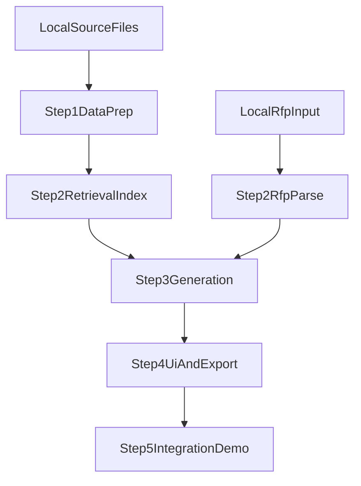

# Architecture

## System Overview

The project is organized as step-wise modules:

1. `step1_data_prep`: prepare retrieval-ready chunks from local proposal files
2. `step2_retrieval_and_rfp_parse`: build retrieval index and parse RFP into structured requirements
3. `step3_generation_pipeline`: generate draft sections from requirements + retrieved context
4. `step4_ui_and_export`: interactive UI flow and document export
5. `step5_integration_and_demo`: end-to-end validation and demo package

## Data Boundary

- Sensitive source data stays outside versioned assets (`local_data/` only).
- Public repo keeps only code, schemas, and documentation.

## Data Flow

## Component Contracts

- Step1 output contract:
  - chunk files with metadata header
  - extraction/chunking summary JSON (local only)
- Step2 output contract:
  - structured RFP JSON schema
  - retrieval hit list with source metadata
- Step3 output contract:
  - section-level generated draft text
  - prompt version and evaluation notes
